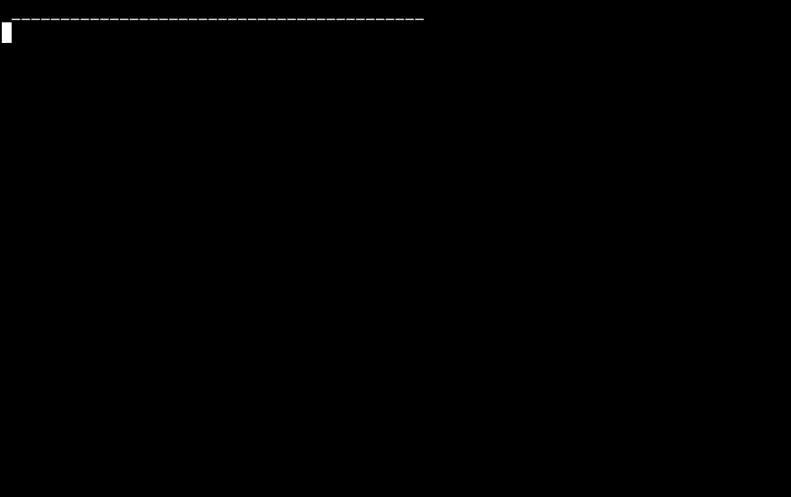

LEARNTYPE
=========

Small CLI children's typing game (4/5 years old). The program shows a
word and the child has to type it letter by letter.

Currently supported languages are:

  - es: Spanish
  - en: English
  - eu: Basque

If you install the "espeak-ng" package, the program will read the
word and the result aloud.

## Usage

You can launch the program in your terminal with `learntype` command or
launch a custom `xterm` setup with good fonts and size with `learntype-xterm`.

Both take two arguments, `-l LANG` for the language and `-n NAME` for
the child's name. When the child achieves a good score, the program
greets the child with a personalized message.

## Installation

You require a working tcl/tk installation. Install as any other make
project.

    $ make install

## Collaborating

For making bug reports, feature requests and donations visit
one of the following links:

1. [gemini://harkadev.com/oss/](gemini://harkadev.com/oss/)
2. [https://harkadev.com/oss/](https://harkadev.com/oss/)
